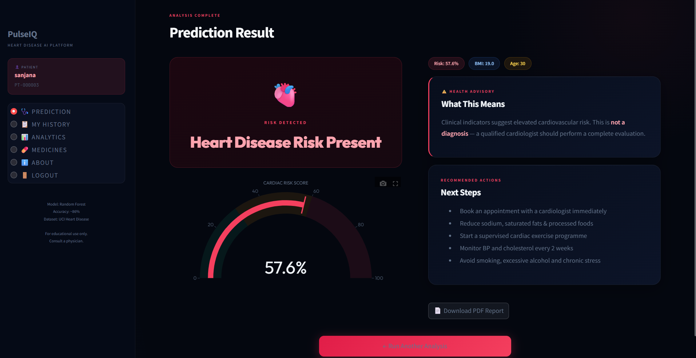

# 🫀 PulseIQ — Heart Disease AI Platform

> An end-to-end machine learning web application for cardiovascular disease risk screening, built with Python and Streamlit.


---

## 🌐 Live Demo
🔗 [Click here to try PulseIQ](https://pulseiq-heart-disease-ai.streamlit.app)

---

## 🔗 Project Links

- Live Demo: https://pulseiq-heart-disease-ai.streamlit.app
- GitHub Repository: https://github.com/niranjanadevi1511/PulseIQ-Heart-Disease-AI

---

## 📸 Application Preview



---

## 📌 About
PulseIQ is a full-stack AI-powered web application that predicts the risk of heart disease
from clinical parameters. It uses a trained **Random Forest classifier** on the
**UCI Heart Disease dataset** (303 samples, 14 features) and returns a continuous
risk percentage using `predict_proba()` — giving more actionable insight than a simple yes/no result.

Built as a final-year Computer Science project to demonstrate real-world ML deployment.

---

## 🎯 Key Highlights

- End-to-end Machine Learning deployment project
- Publicly deployed on Streamlit Cloud
- User authentication and role-based access
- SQLite database integration
- Interactive analytics dashboard
- PDF report generation
- Mobile and desktop responsive interface

---

## ✨ Features

| Feature | Description |
|---|---|
| 🔐 Secure Auth | SHA-256 hashed passwords, session management |
| 🪪 Patient IDs | Auto-generated unique patient IDs (PT-XXXXXX) |
| 🫀 AI Prediction | Random Forest model with 86% accuracy |
| 📊 Risk Gauge | Plotly interactive risk score visualisation |
| 🗄️ SQLite DB | Persistent storage for users and predictions |
| 📋 History | Full prediction history per patient |
| 🩺 Doctor View | Separate doctor dashboard with all records |
| 📄 PDF Export | Downloadable clinical report per prediction |
| ⚖️ BMI Calculator | Auto-calculated from height and weight |
| 🌙 Dark UI | Custom dark theme with CSS styling |

---

## 🧠 ML Model

- **Algorithm:** Random Forest Classifier
- **Dataset:** UCI Heart Disease Dataset (Multi-source)
- **Total Samples:** 920 | **After cleaning (dropna):** 239
- **Features used:** 10 out of 16
- **Test Accuracy:** ~86.7%
- **Training Accuracy:** 100%
- **Output:** `predict_proba()` → continuous risk % (not binary)

**Preprocessing:**
- Label Encoding applied to all categorical columns
- Rows with missing values dropped (`dropna`)
- Target variable `num` binarized (0 = no disease, 1 = disease)

**Input Features:**
`age`, `sex`, `chest pain type`, `resting BP`, `cholesterol`,
`max heart rate`, `exercise-induced angina`, `ST depression`,
`major vessels`, `thalassemia`

---

## 🛠️ Tech Stack

- **Frontend:** Streamlit + Custom CSS
- **Backend:** Python 3.12
- **ML:** Scikit-learn (Random Forest)
- **Database:** SQLite3
- **Charts:** Plotly
- **PDF:** FPDF2
- **Auth:** Hashlib (SHA-256)

---

## 👩‍💻 Author

Niranjana Devi

Final Year B.E. Computer Science Engineering

GitHub: [niranjanadevi1511](https://github.com/niranjanadevi1511)

---

## 🚀 Run Locally

```bash
# 1. Clone the repo
git clone https://github.com/niranjanadevi1511/PulseIQ-Heart-Disease-AI.git
cd PulseIQ-Heart-Disease-AI

# 2. Install dependencies
pip install -r requirements.txt

# 3. Run the app
streamlit run app.py
```

> Make sure `heart_model.pkl` is in the same folder as `app.py`

---

## 📁 Project Structure
